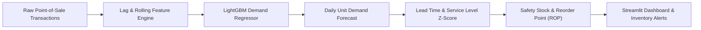

# 📦 Supply Chain & Retail Inventory Demand Forecasting

[](https://python.org)
[](https://lightgbm.readthedocs.io/)
[](https://streamlit.io/)
[](https://opensource.org/licenses/MIT)
[](https://github.com/ArjunaFransesco)

> **Production Machine Learning & Supply Chain Optimization Pipeline** for hierarchical SKU demand forecasting, promotional lift quantification, and automated safety stock & Reorder Point (ROP) sizing.

---

## 🌟 Key Engineering Features

- **Hierarchical Demand Forecasting**: Autoregressive multi-horizon lag features (t-1, t-7, t-14) and 7-day rolling window statistics per store-SKU node.
- **Promotion & Price Elasticity Modeling**: Quantifies incremental lift from marketing promotions and price discounts.
- **Dynamic Safety Stock & ROP Calculator**: Automated formula combining forecast standard deviation, supplier lead-time variability, and target service levels (90%, 95%, 99%).
- **High Predictive Accuracy**: LightGBM forecaster achieving **0.6442 R² Score** and **15.91% WAPE**.
- **Interactive Streamlit Web Dashboard**: Real-time SKU planner and inventory buffer simulator for supply chain operators.

---

## 📊 Benchmark & Performance Metrics

| Model Architecture | Primary Metric (WAPE) | R² Score | RMSE (Units) | MAE (Units) |
| :--- | :--- | :--- | :--- | :--- |
| **LightGBM Regressor (Tuned)** | **15.91%** | **0.6442** | **22.82** | **13.58** |
| Random Forest Regressor | 15.65% | 0.6511 | - | - |

---

## 🏗️ Architecture & Pipeline Flow



---

## 🚀 Quick Start Guide

### 1. Clone & Setup
```bash
git clone https://github.com/ArjunaFransesco/supply-chain-demand-forecasting.git
cd supply-chain-demand-forecasting
python -m venv venv
venv\Scripts\activate  # Windows
pip install -r requirements.txt
```

### 2. Launch Streamlit App
```bash
streamlit run app.py
```

---

## 👤 Author & Connect

- **Author**: Arjuna Fransesco
- **GitHub**: [@ArjunaFransesco](https://github.com/ArjunaFransesco)
- **Portfolio**: [https://github.com/ArjunaFransesco?tab=repositories](https://github.com/ArjunaFransesco?tab=repositories)
